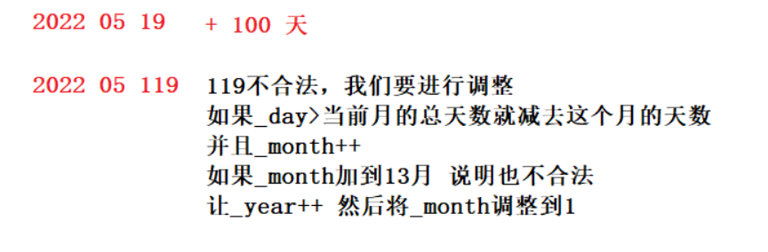
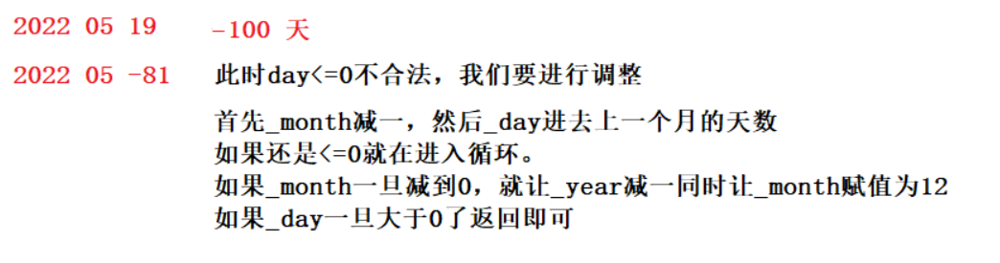

# 操作符重载

<    <=      >           ==    !=   >    >=

注意条件取反  不小于就是 大于等于


年分 平、润   判断平闰年返回2月天数   用数组记录   


复用频繁  考虑inline


注意++ -- 的前置和后置


注意+ 和+=，前者不改变自身，后者改变


> 日期 += 天数



```c++
Date& Date::operator+=(int day)
{
	if (day < 0)
		return *this -= -day;
	_day += day;
	while (_day > GetMonthDay(_year, _month))
	{
		_day -= GetMonthDay(_year, _month);
		_month++;
		if (_month == 13)
		{
			++_year;
			_month = 1;
		}
	}
	return *this;
}
```


> 日期 -= 天数



```c++
Date& Date::operator-=(int day)
{
	if (day < 0)
		return *this += -day;
	_day -= day;
	while (_day <= 0)
	{
		--_month;
		if (_month == 0)
		{
			_month = 12;
			--_year;
		}
		_day += GetMonthDay(_year, _month);
	}
	return *this;
}
```


> 日期 - 日期

1、先默认第一个日期为大日期，第二个日期为小日期。

2、对这两个进行比较，如果第一个是小日期，就将max和min进行日期调换。如果调换说明是小日期-大日期，最终的结果理应该是个负数。因此定义一个flag = 1，如果调换了，让flag = -，最终返回n*flag即可。

3、保持小追大。我们使用前置++运算，让小的日期追大的日期，这里需要定义一个计数器n。每++一次，n就++一次。

```c++
int Date::operator-(const Date& d)
{
	int flag = 1;
	Date max = *this;//默认认为第一大 
	Date min = d;
	if (*this < d)
	{
		min = *this;
		max = d;
		flag = -1;
	}
	int n = 0;
	while (min != max)
	{
		++n;
		++min;
	}
	return n*flag;
}
```

